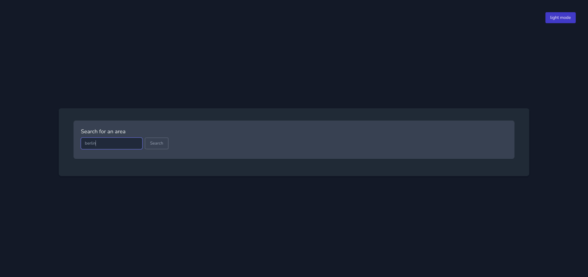
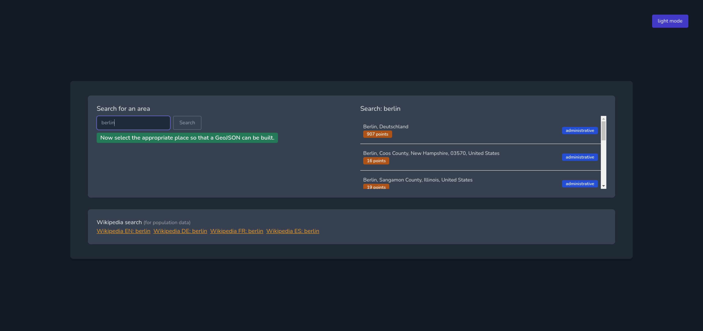
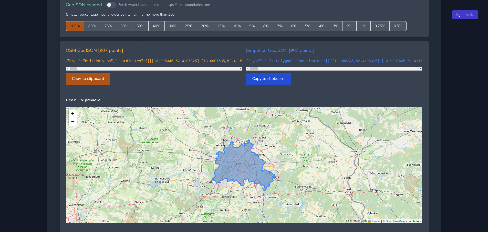
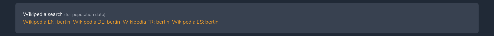

# Creating GeoJSON Areas

The BTC Map API uses [Areas](../api/areas.html) to calculate stats for Communities and Countries.

Originally, these areas were simple rectangles but we have now moved to polygons using the [GeoJSON](https://geojson.org/) format. This provides much more accurate data.

## GeoJSON polygon creation process

### 1. Find your area

Go to [geojson.easify.de](https://geojson.easify.de/) and search for your area (town, city, country).

Select your area from the search results.

### 2. Create your simplified polygon

You can view your polygon on the map and see the number of points it contains. Use the percentage buttons to reduce the number of points to no more than 150.

When you are happy with your polygon you can click on the blue **Copy to clipboard** button under the simplified GeoJSON.

### 3. Validate using linter (optional)

Your GeoJSON should be valid, but if you want to take an extra step and verify you can do this.

Go to [geojsonlint.com](https://geojsonlint.com/) and paste your GeoJSON into the textarea. Click the blue **Test GeoJSON** button. Any errors that need to be fixed will display in a popup modal. Once the code is valid there will be no errors and the area will be displayed on the website. If you receive the `Polygons and MultiPolygons should follow the right-hand rule` error you can visit [this website](https://mapstertech.github.io/mapster-right-hand-rule-fixer/) to 'Rewind' and generate a new file.

### 4. Check population data

Please also add `population` and `population:date` information for the area in question.

There are Wikipedia links for the area which should contain information about the population that you can use.

### 5. Update the Issue

Save and attach the file as `community-name.geojson` to the relevant [Issue](https://github.com/teambtcmap/btcmap-data/issues?q=label%3Acommunity-submission+).

### 6. Fin

One of the Admin team will make the update in the BTC Map DB.
