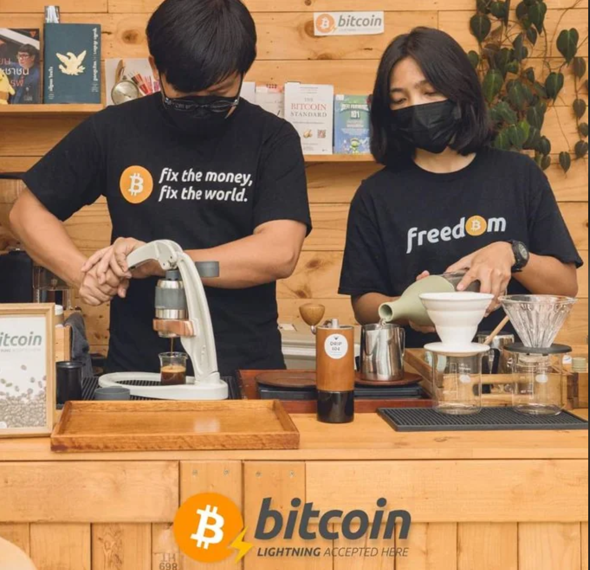
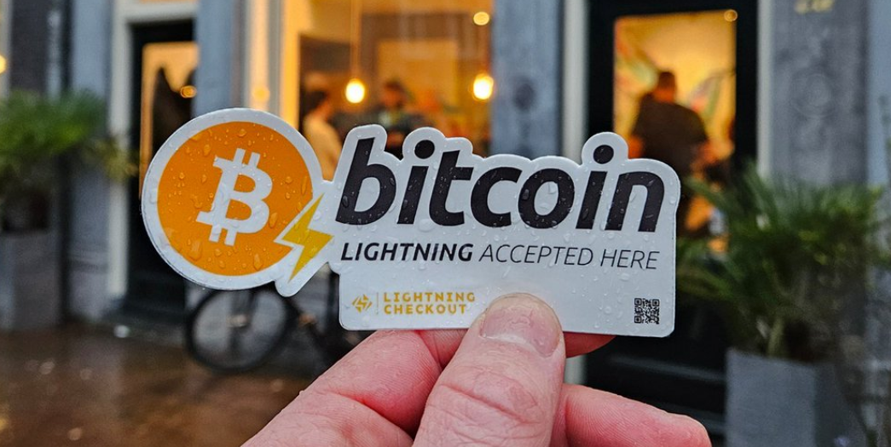
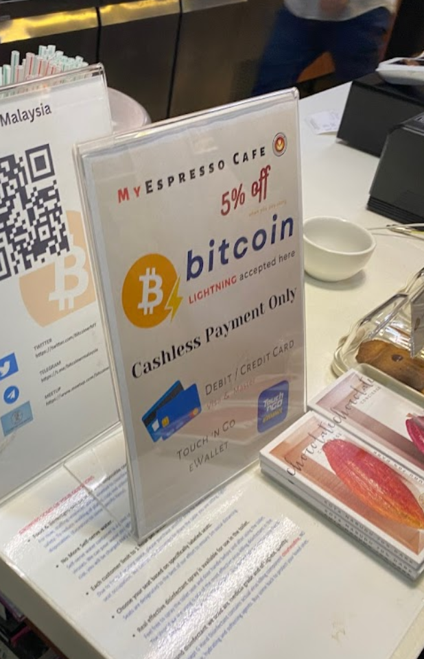

# Merchant Best Practices

Here are a few tips and tricks which will help you boost your bitcoin sales.

## Get a "Bitcoin Accepted" Sticker

Unfortunately, many bitcoiners don't know about BTC Map, and some of them may be your frequent customers. Putting a "Bitcoin Accepted" sticker at your entrance is a good way to target the "offline" audience.

Going all in is fun, but if it's not your cup of tea, a modest sticker wont hurt:

## Mention Bitcoin Acceptance on Your Website or Socials

Make sure your online visitors get the same treatment as the offline ones. People want to know how they can pay you, so it's a good place to mention Bitcoin. It also makes it easier for others to verify your business and update your entry on BTC Map.

## Consider Discounts for Bitcoiners

Everyone likes discounts, and bitcoiners are no exception. Offering a little discount may also help you convert a few locals, and it's always a good idea to expand our movement, which is critical for its success.

## Train Your Staff

Don't forget to notify your staff that you started accepting bitcoins. Many merchants fail to do so, which is the most common source of user complaints. If you hire someone new, don't forget to include Bitcoin training in your onboarding process.

## Check Your Records at Least Once a Year

If you followed the rest of the tips, you probably won't need to update your business details by yourself, it will be done automatically by your happy customers. You can always see the "last checked date" of your place on BTC Map. Make sure that date is no more than one year old. [Here is a guide](./outdated.md) on keeping your listing up-to-date.
