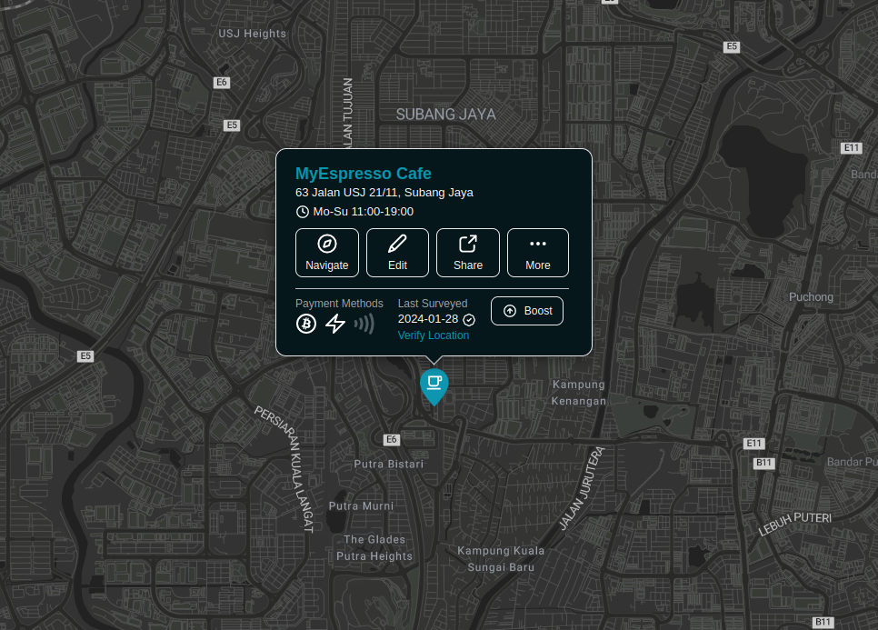
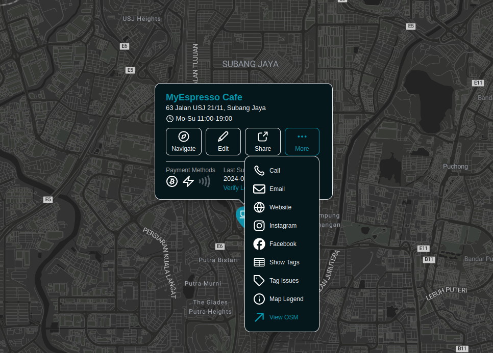
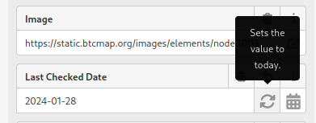
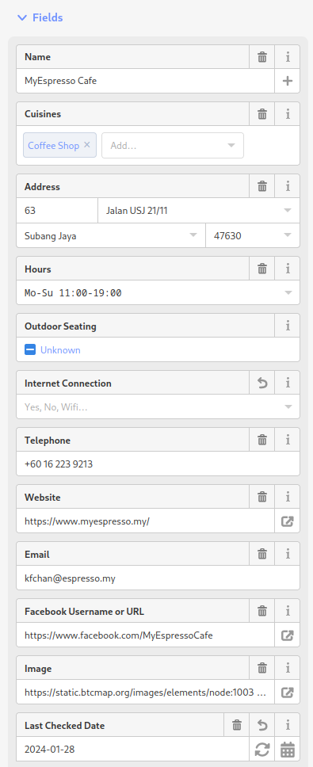
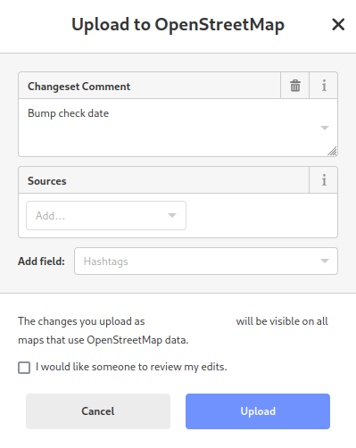
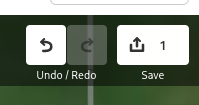

# Outdated Locations

As Satoshi Nakamoto [clearly stated](https://btcmap.org/bitcoin.pdf), Bitcoin is an electronic cash system, and the best way to accelerate Bitcoin adoption is to create a [circular enomomy](https://blog.bitfinex.com/education/a-look-at-bitcoin-circular-economies-around-the-world/).

Having a map of all participating merchants is how we can bootstrap new regions. All bitcoiners should be able to find each other and trade goods and services without touching the fiat infrastructure. That's what we're working on, and we need your help.

Nothing lasts forever, and our merchants are no exception. Some shops may go out of business or just move across the street. That's why we need to check on them from time to time. We're attempting to check every merchant at least once a year, and we can't do it without the help of the local bitcoiners.

If you want to help us accelerate Bitcoin adoption, please read this simple step-by-step guide:

## 1. Find a Merchant on OpenStreetMap

Let's say you're living in (or visiting) Kuala Lumpur, Malaysia, and you want to check the merchants nearby:

It looks like this cafe accepts Bitcoins, and the last verification date is `2024-01-28`. In order to re-verify this place, you need to open it on OpenStreetMap `("More" --> "View OSM")`:

## 2. Update Merchant Details

Now, press the `"Edit"` button to open the location editor:

Check that all fields are valid and accurate. If some fields are outdated or false, please update them.

## 3. Bump Check Date

Set the `"Last Checked Date"` field value to today's date and then press `"Save"`:

Every OSM change needs a short description. If you only changed the check date, you can type `"Bump check date"`. If you updated additional fields, you can mention that as well. After entering the changeset comment, hit the `"Upload"` button.

_Note: There are other tags that can be used to verify a location including `survey:date`. The location you are editing may have one of those tags instead of the `"Last Checked Date"` tag. You can read more about the different verified tags [here](tagging-instructions#verified-tags---more-information)._

## 4. You're Awesome!

As you can see, verifying locations usually takes a couple of minutes, and everyone can do it.
