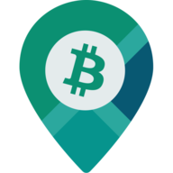

# Home

# Welcome to the BTC Map wiki! 🗺️

**We're on a mission to help Bitcoiners easily find places to spend sats.**

Our website and web app is at [btcmap.org](https://btcmap.org).

Check out our [tagging instructions](general/tagging-instructions.html) for details on how to get your locations showing in our apps and on OpenStreetMap.

Our API endpoints can be accessed at `https://api.btcmap.org/v2/`.

This documentation is organized into two sections. **General** for everything not developer related, and **API** which is meant to help you get started using our API and begin integrating bitcoin mapping data within your own apps.
